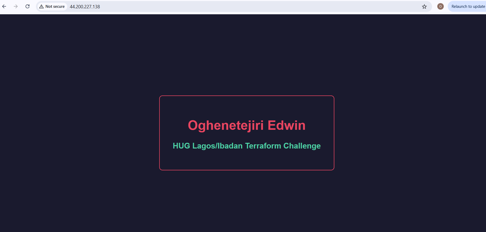
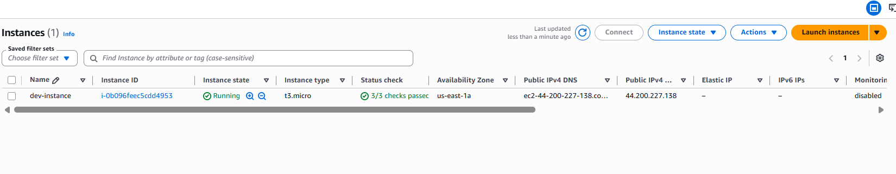
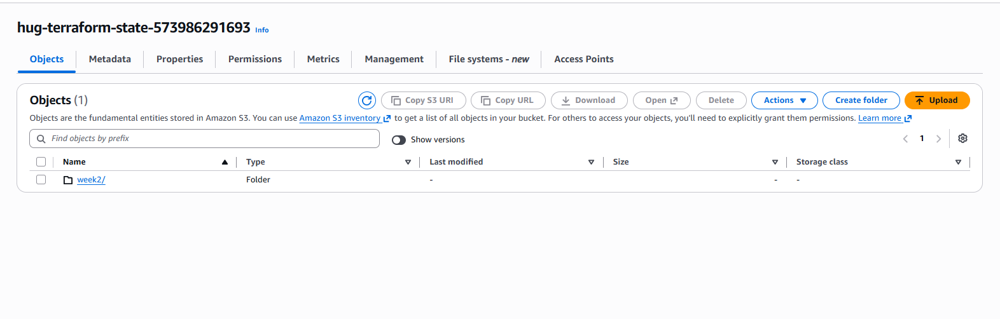
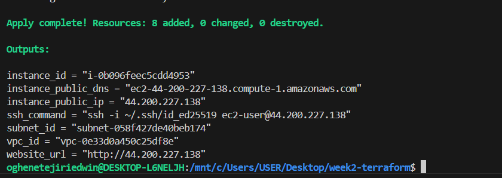

# 🧩 HUG Lagos/Ibadan Terraform Challenge — Week 2

Refactoring Week 1 infrastructure into reusable Terraform modules | Remote Backend with S3 and DynamoDB

[](https://www.terraform.io)
[](https://aws.amazon.com)

---

## 📋 Overview

This project refactors the Week 1 flat Terraform configuration into reusable modules. Each module is responsible for one logical group of resources — making the infrastructure easier to understand, maintain and reuse across environments.

---

## 🔄 Week 1 vs Week 2

| | Week 1 | Week 2 |
|---|---|---|
| Structure | Single `main.tf` file | Modular structure |
| Reusability | None | Each module reusable |
| State storage | Local | Remote (S3 + DynamoDB) |
| Maintainability | Hard to scale | Easy to extend |
| Team friendly | No | Yes |

---

## 🏗️ Architecture

Root Module (main.tf)
↓
┌───────────────────────────────────────┐
│ module/vpc → VPC │
│ module/networking → Subnet │
│ → IGW │
│ → Route Table │
│ module/security-group → SG rules │
│ module/compute → EC2 Instance │
│ → Key Pair │
│ → AMI lookup │
└───────────────────────────────────────┘


---

## 📁 Repository Structure

week2-terraform/
├── .gitignore
├── main.tf
├── outputs.tf
├── terraform.tfvars.example
├── variables.tf
└── modules/
    ├── compute/
    │   ├── main.tf
    │   ├── outputs.tf
    │   └── variables.tf
    ├── networking/
    │   ├── main.tf
    │   ├── outputs.tf
    │   └── variables.tf
    ├── security-group/
    │   ├── main.tf
    │   ├── outputs.tf
    │   └── variables.tf
    └── vpc/
        ├── main.tf
        ├── outputs.tf
        └── variables.tf

---

## 🔒 Remote Backend

Terraform state is stored remotely using:

| Resource | Name | Purpose |
|---|---|---|
| S3 Bucket | `hug-terraform-state-<account-id>` | Stores terraform.tfstate |
| DynamoDB Table | `hug-terraform-locks` | State locking |

**Create backend resources before applying:**
```bash
# Create S3 bucket
aws s3api create-bucket \
  --bucket hug-terraform-state-<YOUR_ACCOUNT_ID> \
  --region us-east-1

# Enable versioning
aws s3api put-bucket-versioning \
  --bucket hug-terraform-state-<YOUR_ACCOUNT_ID> \
  --versioning-configuration Status=Enabled

# Create DynamoDB table
aws dynamodb create-table \
  --table-name hug-terraform-locks \
  --attribute-definitions AttributeName=LockID,AttributeType=S \
  --key-schema AttributeName=LockID,KeyType=HASH \
  --billing-mode PAY_PER_REQUEST \
  --region us-east-1
```

---

## ✅ Prerequisites

- AWS CLI installed and configured
- Terraform >= 1.0 installed
- SSH key pair generated on your machine

**Generate SSH key if you don't have one:**
```bash
ssh-keygen -t ed25519 -C "your-email@example.com"
```

---

## 🚀 Deployment Instructions

**1. Clone the repository:**
```bash
git clone https://github.com/Edwin-Oghenetejiri1/hug-terraform-challenge-week2.git
cd hug-terraform-challenge-week2
```

**2. Create your tfvars file:**
```bash
cp terraform.tfvars.example terraform.tfvars
```

**3. Update `terraform.tfvars` with your values:**
```hcl
env_prefix        = "dev"
vpc_cidr_block    = "10.0.0.0/16"
subnet_cidr_block = "10.0.1.0/24"
my_ip             = ["YOUR_IP/32"]
availability_zone = "us-east-1a"
public_key_path   = "~/.ssh/id_ed25519.pub"
instance_type     = "t3.micro"
key_name          = "your-key-name"
```

**Get your IP:**
```bash
curl ifconfig.me
```

**4. Update backend bucket name in `main.tf`:**
```hcl
backend "s3" {
  bucket = "hug-terraform-state-<YOUR_ACCOUNT_ID>"
  ...
}
```

**5. Initialize Terraform:**
```bash
terraform init
```

**6. Preview changes:**
```bash
terraform plan
```

**7. Apply infrastructure:**
```bash
terraform apply
```

**8. Access the web server:**

website_url = "http://<public-ip>"


Wait 1-2 minutes for Nginx to install via user_data.

---

## 📤 Outputs

| Output | Description |
|---|---|
| `vpc_id` | ID of the created VPC |
| `subnet_id` | ID of the public subnet |
| `instance_id` | ID of the EC2 instance |
| `instance_public_ip` | Public IP of the EC2 instance |
| `instance_public_dns` | Public DNS of the EC2 instance |
| `website_url` | URL to access the web server |
| `ssh_command` | Command to SSH into the instance |

---

## 🖥️ Screenshots

### Web Server


### EC2 Instance Running


### S3 Remote State


### Terraform Outputs


---

## 🧹 Cleanup

```bash
terraform destroy
```

---

## 📚 What I Learned

- Breaking monolithic Terraform into reusable modules
- Each module has its own variables, outputs and resources
- Root module orchestrates all child modules
- Passing outputs from one module as inputs to another
- Configuring remote backend with S3 and DynamoDB state locking
- Why remote state is essential for team collaboration

---

## 🔗 Related

- [Week 1 — Basic Web Server](https://github.com/Edwin-Oghenetejiri1/hug-terraform-challenge)
- [HUG Lagos](https://www.linkedin.com/company/hug-lagos)
- [HUG Ibadan](https://www.linkedin.com/company/hug-ibadan)